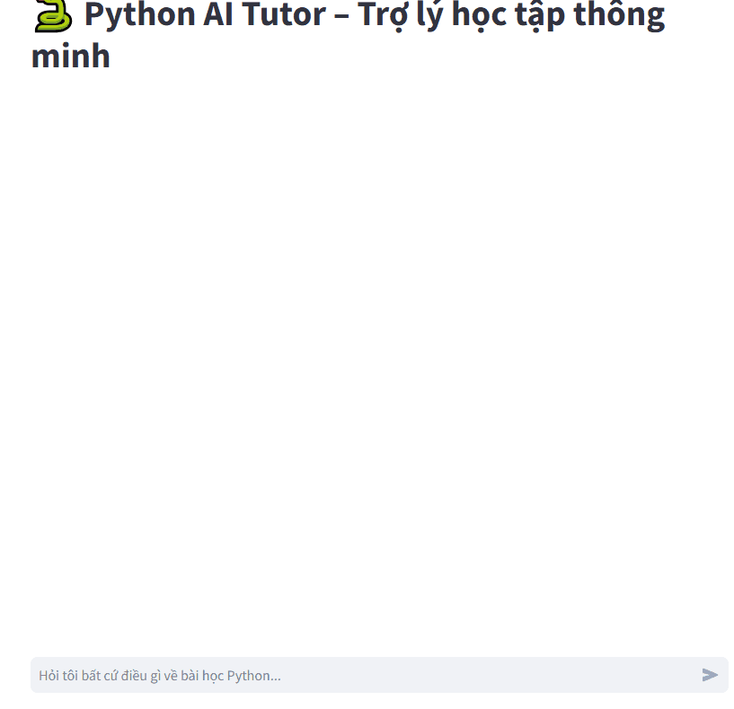

# 🐍 Python AI Tutor - Trợ lý học tập thông minh (RAG)

# Demo
<p align="center">
  
</p>
Dự án sử dụng công nghệ **RAG (Retrieval-Augmented Generation)** để xây dựng một gia sư ảo hỗ trợ học lập trình Python dựa trên các tài liệu bài giảng PDF cá nhân. Hệ thống tích hợp mô hình ngôn ngữ lớn **Google Gemini** và cơ sở dữ liệu vector **ChromaDB**.

## ✨ Tính năng nổi bật
- **Hỏi đáp theo ngữ cảnh:** AI ưu tiên trả lời dựa trên nội dung các file PDF bài giảng được nạp vào.
- **Bộ nhớ hội thoại (Chat Memory):** Ghi nhớ 3 lượt hội thoại gần nhất để hiểu các câu hỏi tiếp nối (ví dụ: "Giải thích rõ hơn về nó").
- **Kiểm soát lưu lượng (Rate Limiting):** Tự động chặn nếu người dùng gửi quá 5 yêu cầu/phút để bảo vệ API Key miễn phí.
- **Xử lý dữ liệu thông minh:** Tự động chia nhỏ văn bản (chunking) và nạp vào Vector DB theo từng đợt để tránh lỗi quá tải.

## 🚀 Hướng dẫn cài đặt

1. Bước 1: Cài đặt môi trường
Khuyến khích sử dụng Python 3.9 trở lên. Tạo môi trường ảo và cài đặt thư viện:

   ```bash
   python -m venv .venv
   source .venv/bin/activate  # Linux/Mac
   # hoặc
   .venv\Scripts\activate     # Windows    
    pip install -r requirements.txt```

2. Bước 2: Cấu hình API Key
Tạo file .env tại thư mục gốc và dán API Key của bạn vào (Lấy tại Google AI Studio):
Mã

   ```bash
   GOOGLE_API_KEY=your_api_key_here
   ANONYMIZED_TELEMETRY=False


3. Bước 3: Chuẩn bị dữ liệu
Copy các file bài giảng PDF (ví dụ: SGK_TIN_12_CS_KNTT_bai4.pdf) vào thư mục data/. (dạng text, không phải OCR)

4. Bước 4: Nạp dữ liệu vào hệ thống
Chạy script để AI "đọc" và phân tích tài liệu:

   ```bash
   python ingest.py

5. Bước 5: Chạy ứng dụng
Mở giao diện chat để bắt đầu học tập:

   ```bash
   streamlit run app.py

## 🛠 Công nghệ sử dụng
LLM: Google Gemini 1.5 Flash / 2.5 Flash.

Framework: LangChain (ConversationalRetrievalChain).

Vector Database: ChromaDB.

UI: Streamlit.

PDF Loader: PyMuPDF.

Lưu ý: Nếu sử dụng gói API miễn phí, hãy đảm bảo không spam câu hỏi quá nhanh để tránh lỗi Rate Limit.

## 📁 Cấu trúc thư mục
```text
python_ai_tutor/
├── app.py              # Giao diện người dùng Streamlit & Logic Chat
├── ingest.py           # Script nạp dữ liệu từ PDF vào Vector DB
├── utils.py            # Cấu hình lõi (LLM, Embeddings, PDF Processing)
├── .env                # Lưu trữ Google API Key (Cần tạo thủ công)
├── requirements.txt    # Danh sách thư viện cần cài đặt
├── data/               # Thư mục chứa các file PDF bài giảng (Ví dụ: SGK Tin học 12)
└── chroma_db/          # Cơ sở dữ liệu Vector (Tự động sinh ra)


